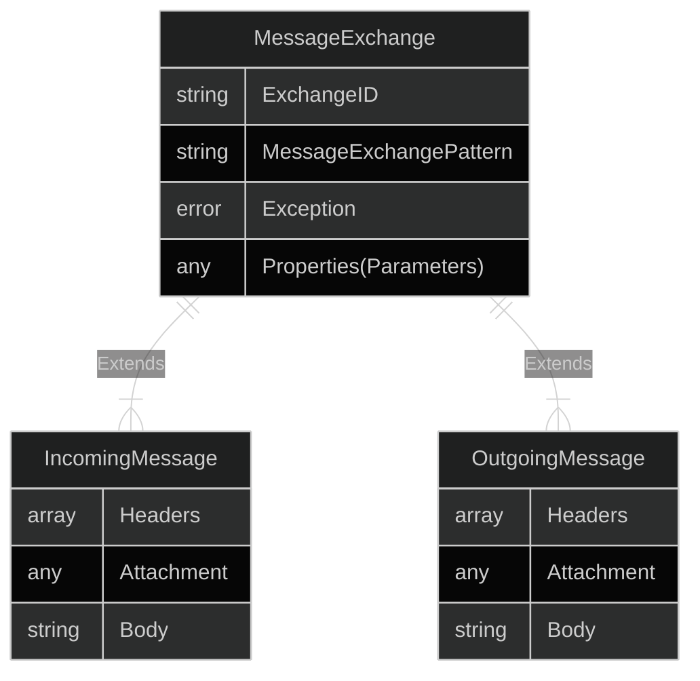

## SAP Cloud Integration
Cloud Integration describes a set of features that support **end-to-end integration** through the **exchange of messages**. Cloud Integration is based on Apache Camel and extended by Low-Code tools developed by SAP. It's a key component of the [[SAP Integration Suite]].
### Integration Flow tools
A core feature if SAP Cloud Integration is the Integration Flow (*iFlow*) editor. It provides connectivity features using **adapters**, which are based on **Enterprise Integration Patterns**. 

> [!info]
> Integration flows connect systems using a variety of adapters, for example for
> - Sync/Async execution
> - Request-Reply/Event-Driven architecture
> - Manually/Automatically triggered
> - Systematic/Processual connectivity

The core features of Integration Flows include:

| Feature               | Example                                                                |
| --------------------- | ---------------------------------------------------------------------- |
| **Routing**           | Execute different flows based on message properties                    |
| **Transformation**    | Change message headers and payloads to match target system schema      |
| **Security**          | Encrypt, decrypt and verify message contents                           |
| **Persistence**       | Storing message contents in a local store or a remote database/service |
| **Call ext. Service** | Enrich messages by retrieving data from a third-party API              |
| **Pub/Sub**           | Subscribe and react to events from a variety of external channels      |

There is also a variety of integrations available on the [API Business HUB](https://api.sap.com/discoverintegrations). If customers require custom adapters, they can be developed using the [SAP SDK](https://help.sap.com/docs/cloud-integration/sap-cloud-integration/developing-custom-adapters)

### Development Cycle
iFlows are deployed via the browser. Each **flow is a separate** Multi-Tenant capable **application** in a customer's tenant's **Cloud Foundry**

The resources on a cloud integration tenant are limited as follows: 

| **Management Node**                  | **Worker Node**                                           | **Database** | **Message Broker** |
| ------------------------------------ | --------------------------------------------------------- | ------------ | ------------------ |
| 1 CPU 2GB RAM 200 HTTP Threads | 2 CPUs 4GB RAM 200 HTTP Threads 8 DB Connections | 32GB         | 9.3GB 30 queues |

You can find a [[Development Cycle to create iFlows|checklist on what tasks to complete for this topic here]]

### Message Monitoring
CPI is monitored by a variety of solutions using SAC, cALM or built-in solutions. The latter is used by administrators of the integration Suite and can be  accessed using `Monitor->Integrations and APIs->Message status overview`. 

Message monitor tracing is especially relevant to debugging flows. Trace logging can be enabled after deploying a flow by navigating into `Monitor->Integrations and APIs->Manage Integration Content` and set the Log Level to *trace*. The built-in logger will then capture messages, their headers and payloads to be analyzed and debugged.

> [!tldr] Monitoring and tracing
> - Use the log-level **trace** to see messages and their contents
> - Use message **simulation** to start messages with a defined payload
> - Combine the two to test and troubleshoot iFlows
> - Use [[Add to message log|Groovy scripts]] to log payloads or message information

Another method of reading the logs of a tenant is by using the [Cloud API](https://api.sap.com/api/MessageProcessingLogs/overview). It is generally considered good practice to deploy and monitor flows procedures several times.

### The Camel data model
While Camel processes inbound and outbound messages, it temporarily enriches them with metadata, such as a unique identifier and properties. These are used to control the message flow, call external data and manipulate the message exchange.

- Incoming and outgoing messages consist of **HTTP headers**, **a body** and optional **attachments**
- During the message exchange, these values are enriched by several **metadata** values

In SAP Integration Suite, there are multiple ways to access and change each of these values. The most prominent are the **[[Integration flows#Transformation|Content modifier component]]**, the usage of the **Groovy and JS SDKs**, as well as [**User Defined Functions**](https://help.sap.com/docs/cloud-integration/sap-cloud-integration/message-mapping) and **[[XSLT Mapping|XLST]]** for more complex scenarios

> [!info] Groovy Playground IDE
> You can test custom groovy scripts in the [Online Groovy IDE for CPI](https://groovyide.com/cpi)
> It automatically provides `com.sap.gateway.ip.core.customdev.util.Message`

