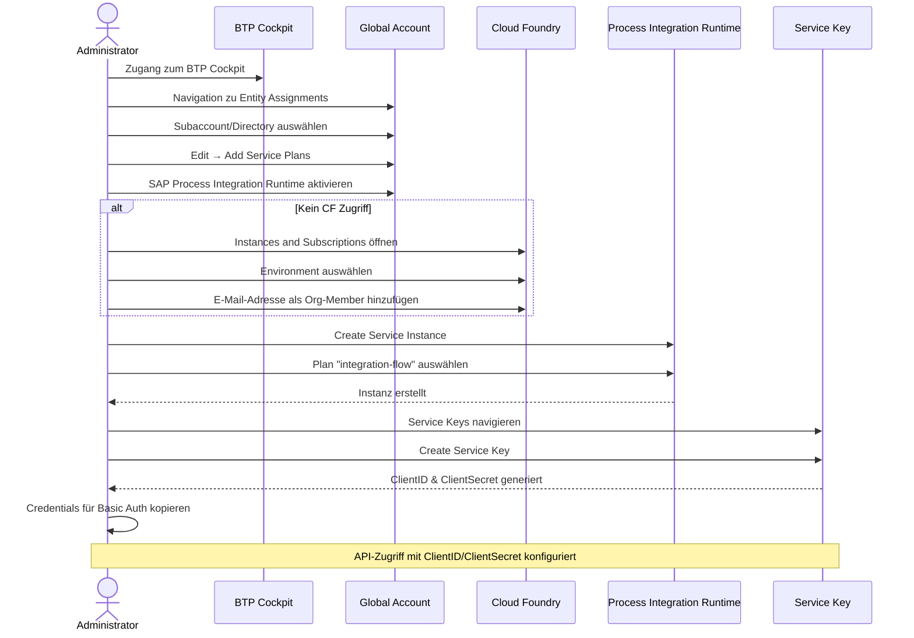

## Voraussetzungen
- Berechtigungen zur Verwaltung von Service-Entitlements und Subscriptions im SAP BTP Global Account
- Zugang zum SAP BTP Cockpit
- E-Mail-Adresse des Nutzers für Cloud Foundry Berechtigungen

## Schrittweise Konfiguration

### Service-Entitlement aktivieren
1. Im BTP Cockpit auf den Global Account wechseln
2. Zu **Entity Assignments** navigieren
3. Subaccount oder Directory auswählen
4. Auf **Edit** → **Add Service Plans** klicken
5. **SAP Process Integration Runtime** auswählen

### Zugriff auf Cloud Foundry Umgebung sicherstellen
Falls kein Zugriff besteht, muss die eigene E-Mail-Adresse als Org-Member hinzugefügt werden:

1. Zu **Instances and Subscriptions** navigieren
2. Entsprechendes Environment auswählen
3. **Weitere Optionen** → **Update** auswählen
4. E-Mail-Adresse hinzufügen

**Alternativ**: Owner kontaktieren für die Hinzufügung der Berechtigung

### Service-Instanz anlegen
1. Auf **Create** klicken
2. **Service** → **SAP Process Integration Runtime** auswählen
3. Plan `integration-flow` auswählen
4. Instanz erstellen

### Service Key generieren
1. Service-Instanz öffnen
2. Zu **Service Keys** navigieren
3. Auf **Create** klicken
4. **ClientID** und **ClientSecret** aus der bereitgestellten JSON kopieren

### API-Authentifizierung konfigurieren
Die kopierte ClientID und das ClientSecret für Basic Auth beim API-Aufruf verwenden.

**Wichtig**: Dies ist die empfohlene Methode für den Zugriff auf APIs via Service Key.

## Sicherheitshinweise
- Passwörter und Service Keys niemals ungesichert weitergeben oder speichern
- Berechtigungen regelmäßig überprüfen und nicht mehr benötigte Zugänge entfernen
- Unternehmensrichtlinien für Sicherheit und Compliance beachten

## Prozess
