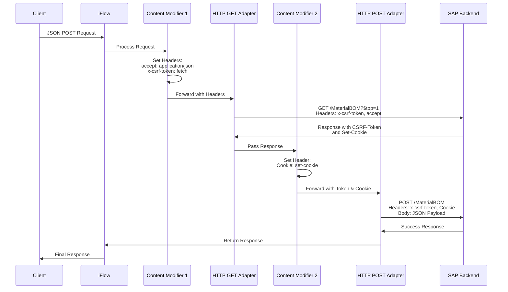

## Symptome
- Standard SAP OData Adapter kann nicht mit JSON POST Payloads umgehen
- Atom XML wird nicht vom Backend akzeptiert, z.B. beim BillOfMaterial v0002 Service

## Voraussetzungen
- Zugriff auf SAP Integration Suite
- Credentials für das SAP Backend-System
- `API_BILL_OF_MATERIAL_SRV` oder vergleichbarer OData Service

## Schrittweise Konfiguration

### Konfiguration des iFlows
1. Neuen iFlow anlegen
2. Runtime Configuration öffnen
3. Parameter `HTTP Session Reuse` auf `On Exchange` setzen

Die Einstellung sorgt dafür, dass CSRF-Token und Session-ID korrekt gesichert werden und im POST Request zur Verfügung stehen.

### Aufbau des iFlows

#### 1. Content Modifier: Header für CSRF-Token Request
Setzen von zwei Header-Parametern:
- `accept: application/json`
- `x-csrf-token: fetch`

#### 2. HTTP GET Adapter: CSRF-Token abrufen
1. Adresse konfigurieren, z.B. `API_BILL_OF_MATERIAL_SRV;v=0002/MaterialBOM`
2. Query Parameter hinzufügen: `$top=1`
3. Credentials für Backend-System hinterlegen
4. Request Headers eintragen: `x-csrf-token|accept`

#### 3. Content Modifier: Cookie speichern
Setzen von einem Header-Parameter:
- `Cookie: set-cookie` (Source Type: Header)

#### 4. HTTP POST Adapter: POST Request ausführen
1. Adresse konfigurieren, z.B. `API_BILL_OF_MATERIAL_SRV;v=0002/MaterialBOM`
2. Credentials für Backend-System hinterlegen
3. Request Headers eintragen: `x-csrf-token|Cookie`

## Prozess

