## Symptome
- Es besteht keine Verbindung zwischen einem Public Cloud System und einer BTP Landschaft

## Voraussetzungen
- Zugang zum SAP BTP Cockpit
- Berechtigungen zur Verwaltung von Service-Assignments und Entity-Assignments im globalen Account
- Vorheriger Schritt [[Verbindung zwischen BTP und EPR herstellen]] wurde durchgeführt

## Schrittweise Konfiguration

### Service-Entitlements aktivieren
1. Im BTP Cockpit auf den Global Account wechseln
2. Zu **Entity Assignments** navigieren
3. Subaccount oder Directory auswählen
4. Auf **Edit** → **Add Service Plans** klicken
5. **Event Mesh** auswählen 
6. Pläne `enterprise-messaging` wie `enterprise-messaging-hub` auswählen 
7. **SAP S4/HANA Cloud Extensibility** auswählen
8. Pläne nach Bedarf aktivieren, mindestens aber `messaging`

## Prozess
Hinweis: Automatisch per KI erstellt

```mermaid
sequenceDiagram
    actor Admin as Administrator
    participant BTP as BTP Cockpit
    participant GA as Global Account
    participant EA as Entity Assignments
    participant SP as Service Plans
    participant EM as Event Mesh
    participant S4 as S/4HANA Cloud Extensibility

    Admin->>BTP: Zugang zum BTP Cockpit
    Admin->>GA: Zu Global Account wechseln
    Admin->>EA: Zu Entity Assignments navigieren
    Admin->>EA: Subaccount oder Directory auswählen
    
    Admin->>EA: Edit klicken
    Admin->>SP: Add Service Plans klicken
    
    rect rgb(20, 22, 25)
        Note over Admin,EM: Event Mesh Pläne aktivieren
        Admin->>SP: Event Mesh auswählen
        Admin->>EM: Plan "enterprise-messaging" auswählen
        Admin->>EM: Plan "enterprise-messaging-hub" auswählen
        EM-->>Admin: Pläne ausgewählt
    end
    
    rect rgb(22, 25, 20)
        Note over Admin,S4: S/4HANA Cloud Extensibility aktivieren
        Admin->>SP: SAP S4/HANA Cloud Extensibility auswählen
        Admin->>S4: Plan "messaging" (mindestens) auswählen
        Admin->>S4: Weitere Pläne nach Bedarf aktivieren
        S4-->>Admin: Pläne ausgewählt
    end
    
    Admin->>EA: Save klicken
    EA-->>Admin: Entitlements aktiviert
    
    Note over Admin,S4: Service-Entitlements erfolgreich konfiguriert
```
