## Voraussetzungen
- Zugang zum SAP BTP Cockpit und entsprechende Berechtigungen für Service-Instanziierung sowie Zugang zum S/4HANA System.
- [[Verbindung zwischen BTP und EPR herstellen]]
- [[Deployment von Event Mesh & Cloud Messaging im Subaccount ermöglichen]]

## Schrittweise Konfiguration
### Deployment des S4-Cloud Messagings im BTP Subaccount
1. Im gewünschten BTP Subaccount den Service `s4-hana-cloud-messaging` deployen
2. Passenden Namespace gemäß Event Mesh Vergabe hinterlegen
3. [[Cloud Enterprise Messaging|Beispielkonfiguration]] für Cloud Enterprise Messaging beachten

### Deployment des Event Mesh Service im BTP Marketplace
1. Im SAP BTP Cockpit auf den gewünschten Subaccount wechseln
2. Service Marketplace öffnen
3. Event Mesh suchen und neue Subscription erstellen **(Die Subscription)**
4. Unter Instances and Subscriptions zum Event Mesh Service navigieren
5. Create → Event Mesh (Enterprise Messaging) wählen **(Den Service)**
6. Instanzdetails festlegen mit Instance-Plan Default und eindeutigen Namen vergeben
7. Konfiguration nach [[Event Mesh Config|diesem Beispiel]] vornehmen

## Prozess
Hinweis: Automatisch per KI erstellt

```mermaid
sequenceDiagram
    actor Admin as Administrator
    participant BTP as BTP Cockpit
    participant Sub as Subaccount
    participant SM as Service Marketplace
    participant S4CM as S4-HANA Cloud Messaging
    participant EM as Event Mesh
    participant IS as Instances and Subscriptions

    Note over Admin,IS: Voraussetzungen: BTP-EPR Verbindung hergestellt

    Admin->>BTP: Zugang zum BTP Cockpit
    Admin->>Sub: Zu gewünschtem Subaccount wechseln
    
    rect rgb(20, 22, 25)
        Note over Admin,S4CM: Deployment S4-Cloud Messaging
        Admin->>Sub: Service s4-hana-cloud-messaging deployen
        Admin->>S4CM: Passenden Namespace hinterlegen
        S4CM-->>Admin: Service konfiguriert
    end
    
    rect rgb(22, 25, 20)
        Note over Admin,EM: Event Mesh Subscription erstellen
        Admin->>SM: Service Marketplace öffnen
        Admin->>SM: Event Mesh suchen
        Admin->>SM: Neue Subscription erstellen
        SM-->>Admin: Subscription erstellt
    end
    
    rect rgb(25, 23, 20)
        Note over Admin,IS: Event Mesh Service Instance
        Admin->>IS: Instances and Subscriptions öffnen
        Admin->>IS: Zu Event Mesh Service navigieren
        Admin->>IS: Create → Event Mesh (Enterprise Messaging)
        Admin->>EM: Instance-Plan "Default" wählen
        Admin->>EM: Eindeutigen Namen vergeben
        Admin->>EM: Konfiguration nach Beispiel vornehmen
        EM-->>Admin: Service Instance erstellt
    end
    
    Note over Admin,IS: Deployment abgeschlossen
```

