## Voraussetzungen
Zugang zum SAP BTP Cockpit und entsprechende Berechtigungen für Service-Instanziierung sowie Zugang zum S/4HANA System.

## Schrittweise Konfiguration

### Event Mesh Subscription im BTP Marketplace
1. Im SAP BTP Cockpit auf den gewünschten Subaccount wechseln
2. Service Marketplace öffnen
3. Event Mesh suchen und neue Subscription erstellen
4. Unter Instances and Subscriptions zum Event Mesh Service navigieren
5. Create → Event Mesh (Enterprise Messaging) wählen
6. Instanzdetails festlegen mit Instance-Plan Default und eindeutigen Namen vergeben
7. Konfiguration nach [[Event Mesh Config|diesem Beispiel]] vornehmen

### Cloud Messaging Service instanziieren
1. Unter Service Marketplace den Cloud Messaging Service auswählen und Instanz erzeugen
2. Im Global Account das S/4 System über Service Token anlegen
3. System Landscape → Systems → Add System navigieren
4. Token generieren über Get Token mit allen Kommunikationsszenarien

### Integration im S/4HANA System
1. Im S/4 System die App SAP-BTP-Erweiterungen pflegen öffnen
2. Generierten Service Token einfügen
3. Kommunikationsszenarien SAP_COM_0092 im System aktivieren

### Deployment im BTP Subaccount
1. Im gewünschten BTP Subaccount den Service s4-hana-cloud-messaging deployen
2. Passenden Namespace gemäß Event Mesh Vergabe hinterlegen
3. [[Cloud Enterprise Messaging|Beispielkonfiguration]] für Cloud Enterprise Messaging beachten

## Prozess

```mermaid
graph LR
    A[BTP Cockpit öffnen] --> B[Event Mesh Subscription anlegen]
    B --> C[Service Marketplace öffnen]
    C --> D[Event Mesh erstellen]
    D --> E[Instanz konfigurieren]
    
    E --> F[Cloud Messaging Service instanziieren]
    F --> G[Service Token im Global Account generieren]
    G --> H[System Landscape öffnen]
    H --> I[Token mit allen Szenarien erstellen]
    
    I --> J[S/4HANA System Integration]
    J --> K[App SAP-BTP-Erweiterungen pflegen öffnen]
    K --> L[Service Token einfügen]
    L --> M[SAP_COM_0092 aktivieren]
    
    M --> N[Deployment im BTP Subaccount]
    N --> O[s4-hana-cloud-messaging deployen]
    O --> P[Namespace konfigurieren]
    P --> Q[Deployment abschließen]
```
