## Voraussetzungen
Siehe [[Deployment von Event Mesh und Cloud Messaging]]

## Schrittweise Konfiguration
### Konfiguration des Events in der Public Cloud  
Nach der Anlage des Cloud Messaging Services können Events in Event Mesh empfangen werden. Jedes Event muss separat aktiviert werden. Siehe auch  [[Apps#Integration]] 

1. Suche des relevanten Events auf [api.sap.com](https://api.sap.com/products/SAPS4HANACloud/events/events)
2. Öffnen der App und Hinzufügen des Events in der App


### Konfiguration im Event Mesh: Queue
Mit Queues können bestimmte Topics aus dem Cloud Event Messaging ausgelesen - sich auf sie subscribed werden. Diese werden bei der Auslösung in die jeweilige Queue hinzugefügt, um weiter verarbeitet werden zu können.

 1. Neue Queue erstellen
2. Subskription auf das Event in der Public Cloud über das jeweilige Topic

### Konfiguration des Webhooks
1. Neuen Webhook erstellen mit Quelle: Queue
2. Ziel-HTTP Endpunkt einstellen, ggf. Credentials hinterlegen
3.  **Alternativ**: Subscription mit AMPQ-Adapter auf das jeweilige Topic aus der Integraiton Suite

## Beispiel für eine Event Subscription
Siehe auch [[Deployment von Event Mesh und Cloud Messaging]] und [[Cloud Enterprise Messaging]] für die Herleitung der Benamung der jeweiligen Subscription

```sh
# Voll Qualifizierter Subscription Name
sap/S4HANAOD/s4ce/ce/sap/s4/beh/businesspartner/v1/BusinessPartner/Changed/v1

# Namespace des Event Mesh des Cloud Messaging Services
sap/S4HANAOD/s4ce

# Cloudevent / SAP / S4 System / Business Event Hub
ce/sap/s4/beh

# Typ des Events aus dem Event Mesh
businesspartner/v1/BusinessPartner/Changed/v1
```

## Prozess

```mermaid
graph LR
    A[Start: Voraussetzungen prüfen] --> B[Event Mesh und Cloud Messaging deployed]
    B --> C[Konfiguration des Events in der Public Cloud]
    C --> D[Relevantes Event auf api.sap.com suchen]
    D --> E[App öffnen und Event hinzufügen]
    E --> F[Konfiguration im Event Mesh: Queue]
    F --> G[Neue Queue erstellen]
    G --> H[Subskription auf Event über Topic]
    H --> I[Konfiguration des Webhooks]
    I --> J{Welche Variante?}
    J -->|Standard| K[Neuen Webhook mit Quelle Queue erstellen]
    K --> L[Ziel-HTTP Endpunkt einstellen]
    L --> M[Optional: Credentials hinterlegen]
    J -->|Alternativ| N[Subscription mit AMPQ-Adapter auf Topic]
    M --> O[End: Event Subscription konfiguriert]
    N --> O
```

