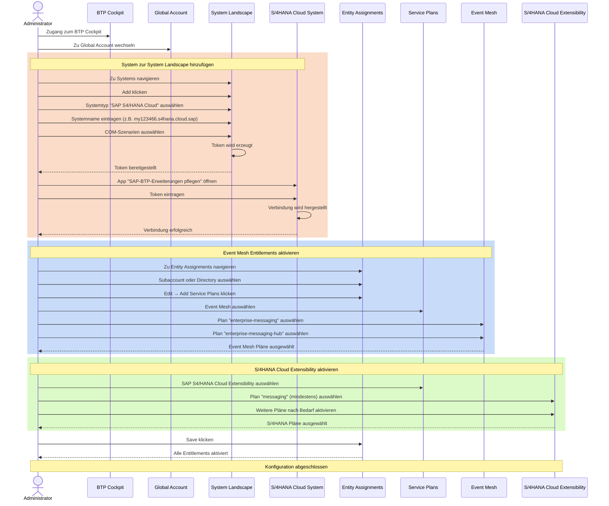

## Symptome
- Für eine S4 Public Cloud Instanz können keine [[Deployment von Event Mesh & Cloud Messaging|Cloud Messaging oder Event Mesh]] Instanzen erstellt werden
- Es besteht keine Verbindung zwischen einem Public Cloud System und einer BTP Landschaft

## Voraussetzungen
- Zugang zum SAP BTP Cockpit
- Berechtigungen zur Verwaltung von Service-Assignments und Entity-Assignments im globalen Account

## Schrittweise Konfiguration

### System zur System Landscape hinzufügen
1. im BTP Cockpit auf den Global Account wechseln
2. Unter System Landscape zu Systems navigieren
3. Auf **Add** klicken
4. **Systemtyp = SAP S4/HANA Cloud** auswählen
5. **Systemname = Host, z.B. my123466.s4hana.cloud.sap** eintragen
6. Auswahl der notwendigen COM-Szenarien & warten, bis Token erzeugt wird
7. Im S4HANA Cloud System die App **SAP-BTP-Erweiterungen pflegen** öffnen
8. Hier das Token eintragen und warten, bis die Verbindung hergestellt wird

### Service-Entitlements aktivieren
1. Im BTP Cockpit auf den Global Account wechseln
2. Zu **Entity Assignments** navigieren
3. Subaccount oder Directory auswählen
4. Auf **Edit** → **Add Service Plans** klicken
5. **Event Mesh** auswählen 
6. Pläne `enterprise-messaging` wie `enterprise-messaging-hub` auswählen 
7. **SAP S4/HANA Cloud Extensibility** auswählen
8. Pläne nach Bedarf aktivieren, mindestens aber `messaging`

## Prozess
Hinweis: Automatisch per KI erstellt
