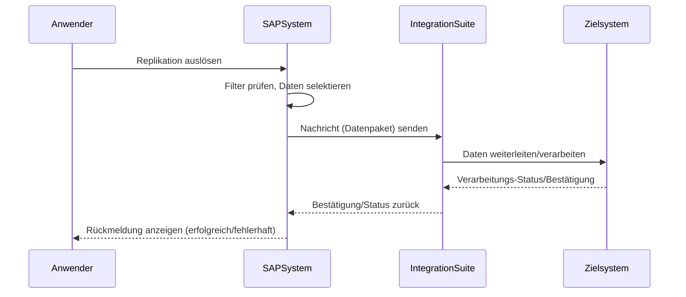

Replikationsmodelle werden für die Synchronisation von Stammdaten über mehrere Systeme verwendet. Sie werden über Kommunikationsvereinbarungen aktiviert und senden, je nach Einstellung, regelmäßig oder eventbasiert SOAP-Nachrichten an ein Zielsystem, z.B. die [[SAP Integration Suite]] ohne einen zwischengelagerten [[Event Mesh Config|SAP Event Mesh]].

> Replikationsmodelle können sich je nach Private oder Public Cloud unterscheiden. Im folgenden geht es nur um RMs aus der Public Cloud, die über SOAP gesendet werden. 

Prominente Replikationen in der Public Cloud sind unter anderem

| **Geschäftsobjekt** | **Kommnikationsszenario** | **Beschreibung**                                                           |
| ------------------- | ------------------------- | -------------------------------------------------------------------------- |
| Verkaufsangebote    | SAP_COM_0A12              | Angebote, die aus dem Vertrieb an Kunden angelegt werden                   |
| Geschäftspartner    | SAP_COM_0008              | Lieferanten, Kunden und sonstige Geschäftspartner                          |
| Produktstammdaten   | SAP_COM_0009              | Unterschiedliche Sichten auf den Produktstamm, z.B. Vertrieb, Werksbezogen |

## Vorteile des Replikationsmodells
- Stammdaten sollen ohne weitere Konfiguration von BTP-Services direkt an die Integration Suite gesendet werden
- Nutzer will größeren Einfluss darauf haben, wann und wie Stamm- und Bewegungsdaten an Drittsysteme gesendet werden
- SOAP-Nachrichten erhalten standardmäßig eine größere Vielfalt an Daten - diese müssten nicht über OData nachgelesen werden

## Konfiguration im S4HANA
1. App **Kommunikationsvereinbarungen** -> Relevante Vereinbarung aktivieren und ausfüllen
2. Bei **Ausgehende Services**->**Zusätzliche Eigenschaften** einen Namen für Replikationsmodell angeben, z.B. **SY_INT_BP** für **Shopify**-**Integration**-**Businesspartner**
3. Wert für Replikationsmodus auswählen, **C = Bei jeder Änderung, I = Nur bei Erstellung**
4. Systemfilter auf X setzen
5. Ausgabemodus auswählen, **P = Job**, **D = Unmittelbar nach Änderung/Erstellung**
6. Anpassung des **Pfades** - dieser muss direkt auf den Endpunkt der Integration Suite zeigen
7. Verbindung testen und prüfen, ob Nachricht von Integration Suite empfangen wird
8. Download des WSDL-Schema
## Ablauf der Replikation

## Filter
Systemfilter können direkt im Replikationsmodell gesetzt werden. Hiermit lässt sich eine Einschränkung der Objekte auf Basis ihrer Ausprägung vornehmen, z.B. Kundengruppe, Produktgruppe, etc.