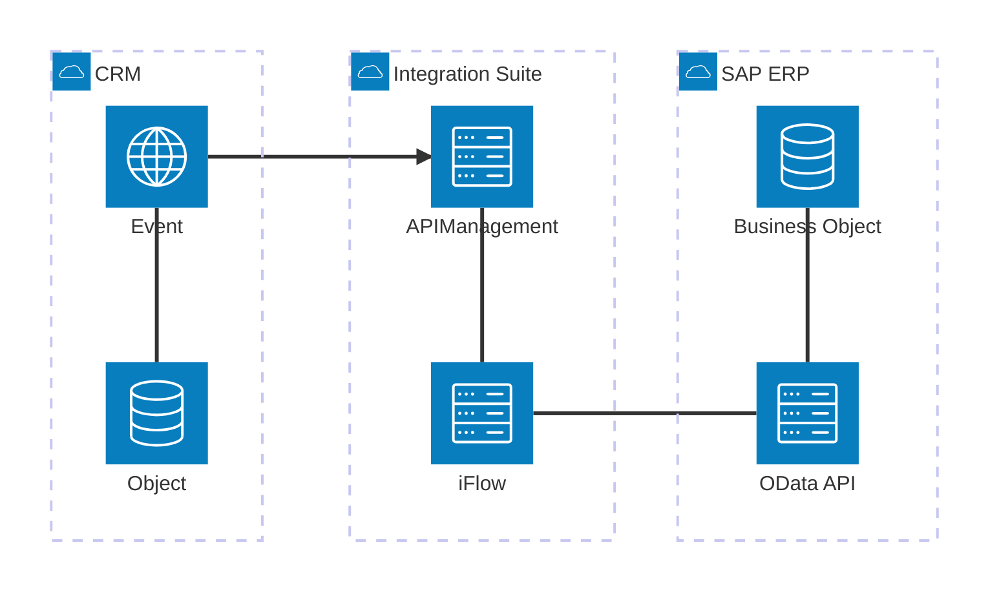
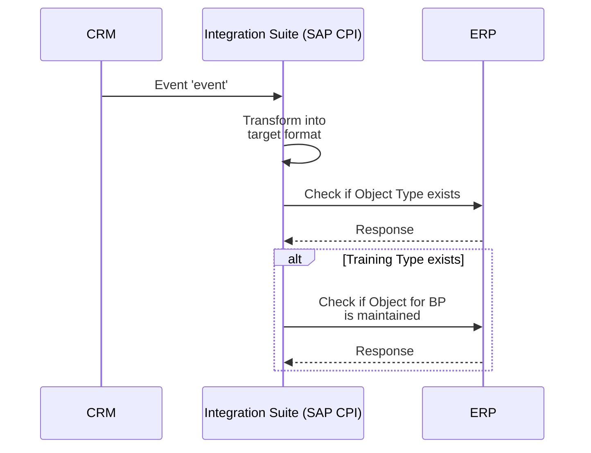

## Architecture Diagram

### Vorschau


### Mermaid-Code

```sh
architecture-beta
    group crm(cloud)[CRM]
    service object(database)[Object] in crm
    service eventbus(internet)[Event] in crm
    object:T -- B: eventbus
    eventbus:R --> L: apimanagement

    group cpi(cloud)[Integration Suite]
    service apimanagement(server)[APIManagement] in cpi
    service iflow(server)[iFlow] in cpi
    apimanagement:B -- T: iflow
    iflow:R -- L:odataapi

    group erp(cloud)[SAP ERP]
    service odataapi(server)[OData API] in erp
    service database(database)[Business Object] in erp
    database:B -- T: odataapi
```

## Sequenzdiagramm

### Vorschau



### Mermaid Code
```sh
sequenceDiagram  
    participant CRM as CRM  
    participant CPI as Integration Suite (SAP CPI)  
    participant ERP as ERP
	  
    CRM->>CPI: Event 'event'  
    CPI->>CPI: Transform into<br>target format  
    CPI->>ERP: Check if Object Type exists  
    ERP-->>CPI: Response  
    alt Training Type exists  
        CPI->>ERP: Check if Object for BP<br>is maintained  
        ERP-->>CPI: Response  
    end
```